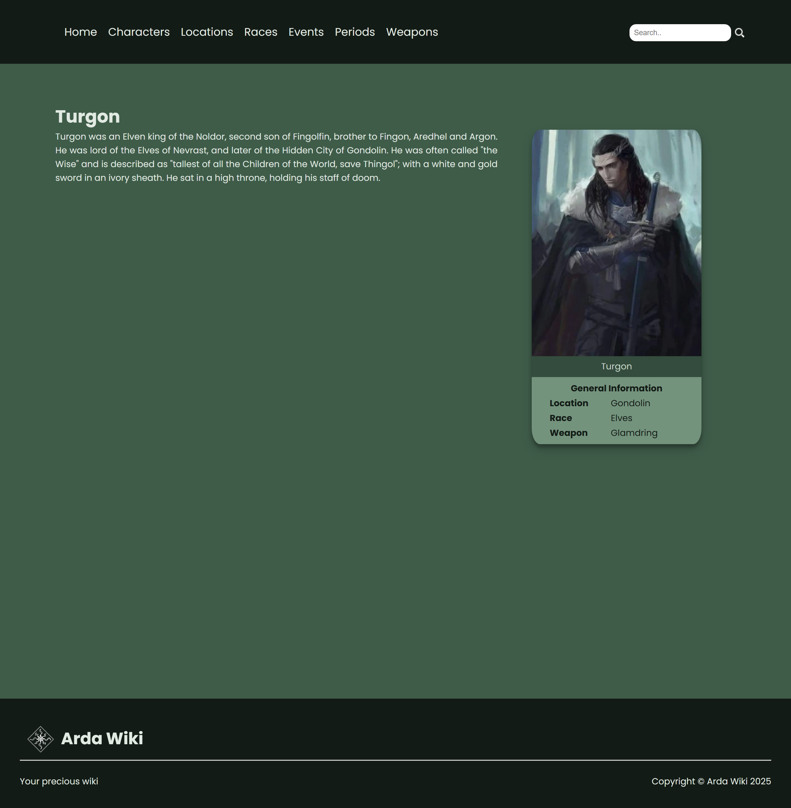
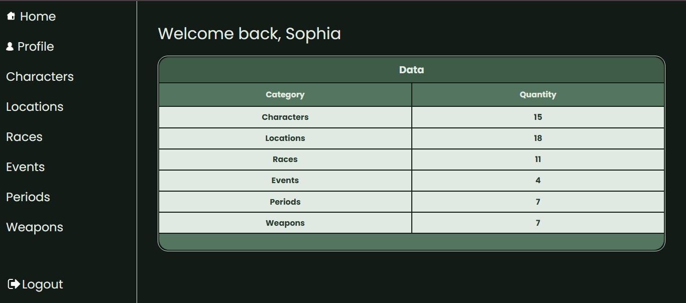
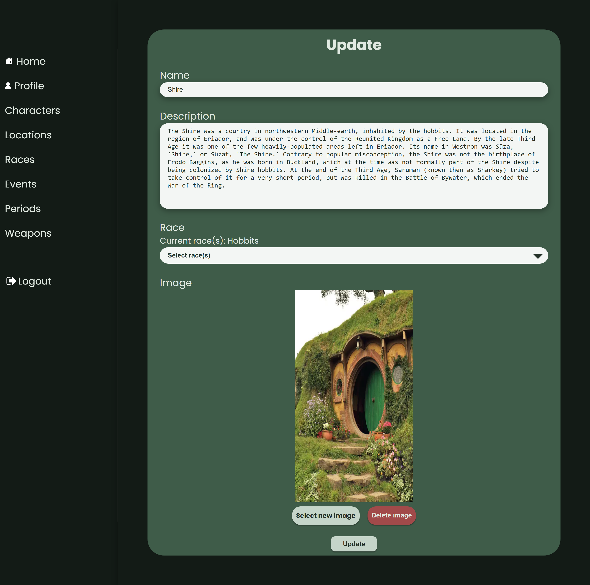

[JAVASCRIPT__BADGE]: https://img.shields.io/badge/Javascript-000?style=for-the-badge&logo=javascript
[CSS3]: https://img.shields.io/badge/css3-%231572B6.svg?style=for-the-badge&logo=css3&logoColor=white
[HTML5]: https://img.shields.io/badge/html5-%23E34F26.svg?style=for-the-badge&logo=html5&logoColor=white
[LINK]: https://arda-wiki.pages.dev/

<h1 align="center" style="font-weight: bold;">Arda Wiki Frontend 💻</h1>

<p align="center">
    <b>A Wiki website themed on JRR Tolkien's universe of Middle Earth. This application will list different Middle Earth characters, locations, events and more.</b>
</p>
<p align="center">
  <b>Visit the <a href="https://arda-wiki.pages.dev/" >Arda Wiki</a> website.</b>
</p>

<p align="center">
    <a href="https://github.com/snportela/arda-wiki-backend">📱 Backend for this Project</a>
</p>

<h2 id="layout">🎨 Layout</h2>

<table>
  <tr>
    <td>Home Page</td>
     <td>Category List Example</td>
     <td>Article Example</td>
  </tr>
  <tr>
    <td></td>
    <td></td>
    <td></td>
  </tr>
 </table>

<h2 id="technologies">💻 Technologies</h2>

- ![HTML5]
- ![CSS3]
- ![JAVASCRIPT__BADGE]

<h2 id="about">📌 About</h2>

<p>
  This project will list Characters, Locations, Races, Events, Periods and Weapons, including an article for each individual item. It also contains a search engine, and an Admin section, where you can manage all the articles for the Wiki. It's possible to add, edit and delete any article from the Admin section. Only logged in users can access the Admin section; this is achieved by using JWT authorization.
</p>

<table align="center">
  <tr>
    <td>Login Page</td>
     <td>Main Admin Page</td>
  </tr>
  <tr>
    <td></td>
    <td></td>
  </tr>
  <tr>
     <td>Location Table</td>
     <td>Location Edit</td>
  </tr>
  <tr>
    <td></td>
    <td></td>
  </tr>
 </table>

<h3>Cloning</h3>

```bash
git clone https://github.com/snportela/arda-wiki-frontend
```
